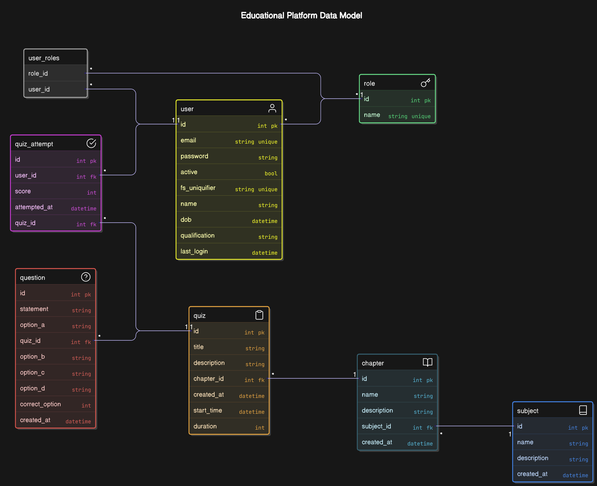

# Quiz Master V2 - Project Report

Modern Application Development II

## Student Details

- **Name:** Rahul Maurya
- **Email:** 23f1002653@ds.study.iitm.ac.in
- **Term:** T1 2025
- **Presentation:** [Video Link](https://drive.google.com/file/d/1w2S_fLCxj1wUBu0FfCn3Lyl53yswBkMO/view?usp=drive_link)

---

# Quiz Master V2

A multi-user exam preparation platform where users can practice quizzes for different subjects and chapters.

The platform has two roles: **Admin** (Quiz Master) and **Users**.

The admin manages subjects, chapters, and quizzes, while users can register, take quizzes, and track their scores.

## Features 🚀

- **User Management**: Admin manages users, and users can register/login.
- **Quiz Creation & Management**: Admin creates subjects, chapters, and quizzes.
- **Timed Quizzes**: Users attempt quizzes with a countdown timer.
- **Score Tracking**: Users can view past quiz scores and performance analytics.
- **Background Jobs**: Celery handles CSV exports, reminders, and reports.
- **Daily Reminders**: Users get notified about new quizzes via email or chat.
- **Monthly Reports**: Users receive a summary of their quiz performance.
- **CSV Export**: Users and Admin can export quiz data.
- **Caching & Performance Optimization**: Redis improves API response times.

## Milestones ✅

During the development of Quiz Master V2, I successfully:

- Designed and set up the complete project structure with Flask backend and Vue.js frontend
- Configured and implemented the Flask API with necessary endpoints
- Implemented a secure user authentication system with role-based access control
- Created comprehensive database models and relationships
- Developed an intuitive admin dashboard for quiz management
- Built a responsive user dashboard for quiz attempts
- Implemented real-time quiz timer functionality
- Designed and implemented score storage and analytics systems
- Set up Celery workers for handling background jobs efficiently
- Integrated Redis caching for improved API performance
- Added CSV export functionality for data portability
- Implemented an automated daily quiz reminder system
- Created a monthly report generation system
- Optimized API performance through strategic caching
- Successfully completed final testing and deployment

## Technical Implementation 📁

### Backend Architecture

```python
backend/                # Server-side application code
├── app.py              # Flask application entry point and configuration
├── cache.py            # Redis cache configuration and helper functions
├── celery_app.py       # Celery task queue setup and worker config
├── cleanup.sh          # Script to reset database and clear cache
├── db/                 # Database related files
│   ├── models.py       # SQLAlchemy model definitions and relationships
│   ├── seed.py         # Database seeding logic and helper functions
│   ├── data_quizzes.py    # Sample quiz data for database seeding
│   └── data_subjects.py   # Sample subject data for database seeding
├── routes/             # API route handlers
├── static/             # Generated files (CSV exports, etc)
└── templates/          # HTML templates and email notifications
```

### Frontend Architecture

```javascript
frontend/               # Client-side application code
└── src/                # Source code directory
    ├── App.vue         # Root Vue component
    ├── main.js         # JavaScript entry point
    ├── assets/         # Static assets (images, styles)
    ├── router/         # Vue Router configuration
    ├── store/          # State management
    └── views/          # Vue components by section
```

## Data Model 📊



## API Design 🛣️

I implemented a comprehensive REST API following RESTful principles and organized routes by domain.

Each route handles specific functionality with proper HTTP methods and status codes.

### Authentication Routes `/api/auth`

- `GET /whoami` - Check current authentication status
- `POST /login` - Login with email and password
- `POST /register` - Register new user account
- `POST /logout` - Logout current user

### Admin Routes `/api/admin`

- `GET /users/<id>` - Get single user details
- `GET /users` - Get all users list
- `PUT /users/<id>/block` - Block a user
- `PUT /users/<id>/unblock` - Unblock a user
- `GET /statistics` - Get platform statistics
- `POST /repopulate` - Reset and reseed database

### User Routes `/api/user`

- `GET /quiz-attempts` - Get user's quiz attempts
- `POST /quiz-attempts/<quiz_id>` - Submit a quiz attempt
- `GET /send-test-email` - Send test email to user
- `POST /export-attempts` - Export user's attempts to CSV

### Subject Routes `/api/subject`

- `GET /get/<id>` - Get single subject
- `GET /get-all` - Get all subjects
- `POST /create` - Create new subject
- `PUT /update/<id>` - Update a subject
- `DELETE /delete/<id>` - Delete a subject

### Chapter Routes `/api/chapter`

- `GET /get/<id>` - Get single chapter
- `GET /get-all` - Get all chapters
- `POST /create` - Create new chapter
- `PUT /update/<id>` - Update a chapter
- `DELETE /delete/<id>` - Delete a chapter

### Quiz Routes `/api/quiz`

- `GET /get/<id>` - Get single quiz
- `GET /get-all` - Get all quizzes
- `POST /create` - Create new quiz
- `PUT /update/<id>` - Update a quiz
- `DELETE /delete/<id>` - Delete a quiz

### Question Routes `/api/question`

- `GET /get/<id>` - Get single question
- `GET /get-all` - Get all questions
- `POST /create` - Create new question
- `PUT /update/<id>` - Update existing question
- `DELETE /delete/<id>` - Delete a question

## Frontend State Management 🗄️

I implemented a reactive store system using Vue.js with the following stores:

### Auth Store

- Manages user authentication state
- Handles role-based access control

### Subject & Chapter Stores

- Manages educational content hierarchy
- Handles CRUD operations and relationships

### Quiz & Question Stores

- Manages quiz content and structure
- Handles quiz creation and updates

### Quiz Attempt Store

- Tracks user attempts and scores
- Manages answer feedback storage

## Challenges and Solutions 💡

1. **Performance Optimization**

   - Implemented Redis caching
   - Optimized database queries
   - Used efficient data structures

2. **State Management**

   - Designed reactive stores
   - Implemented proper data flow
   - Maintained data consistency

3. **Background Processing**
   - Utilized Celery for async tasks
   - Implemented job queuing
   - Created efficient worker processes

## Future Enhancements 🚀

1. Real-time collaboration features
2. Advanced analytics dashboard
3. Mobile application support
4. AI-powered question generation
5. Social learning features

## Learning Outcomes 📚

Through this project, I gained extensive experience in:

1. Full-stack web development
2. Database design and optimization
3. API development and documentation
4. Frontend state management
5. Background task processing
6. Caching strategies
7. User authentication and authorization
